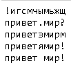
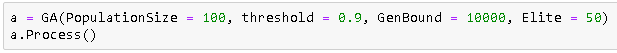

# Генетический алгоритм для генерации заданной строки

Генерация строки "привет мир!"

Запуск алгоритма

**Передаваемые параметры:**
* PopulationSize - размер популяции
* threshold - Вероятность особи не мутировать (1 - P(mutation))
* GenBound - максимальное количество поколений
* Elite - количество элитных особей
* original - генерируемое слово

**Особенности реализации:**
* Скрещивание по битовой маске
* Селекция методом рулетки
* Каждые 100 поколений выводится лучший результат